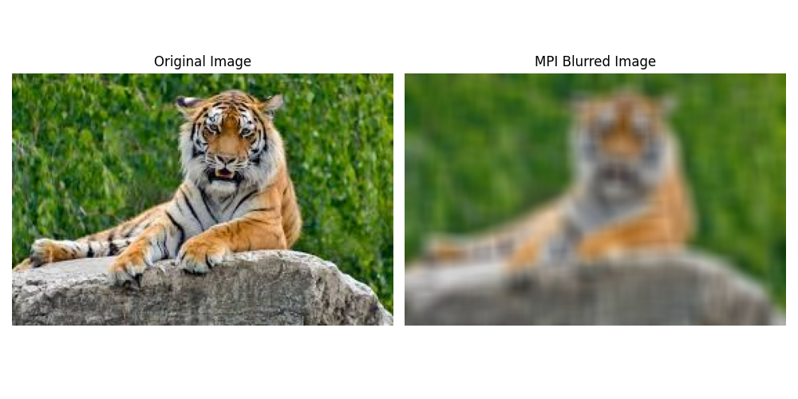
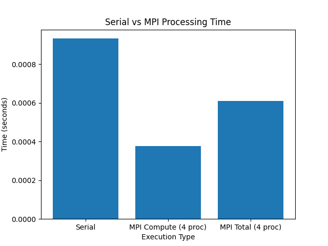

# Parallel Image Blurring using MPI

This project implements a **parallel image blur filter** using **MPI (Message Passing Interface)** in Python.  
The input image is divided into overlapping chunks, processed in parallel by multiple MPI processes, and then combined to produce the final blurred image.

The project also compares **serial vs parallel execution time** to demonstrate the performance benefits of MPI.

## ✨ Features
- Parallel image processing using **mpi4py**
- Supports multiple blur filters:
  - Gaussian Blur
  - Median Blur
  - Box Blur
- Uses overlapping boundaries for smooth edges
- Saves final MPI and serial outputs
- Compares serial and parallel execution times
- Generates result and timing visualizations

## 🛠️ Technologies Used
- Python  
- MPI (`mpi4py`)  
- Pillow (PIL)  
- NumPy  
- Matplotlib  

## 📂 Project Structure
```
project/
├── main.py
├── images/
│   ├── chunk_images/           # Contains chunk images from each MPI process
│   ├── mpi_blurred_image.png
│   └── serial_blurred_image.png
├── results/
│   ├── comparison_plot.png
│   └── timing_results.txt
└── README.md
```

## 🚀 How to Run the Project

### 1️⃣ Install Dependencies
```bash
pip install mpi4py pillow numpy matplotlib
```

### 2️⃣ Run Using MPI
```bash
mpirun -np 4 python main.py
```

### 3️⃣ Inputs Required
When prompted, provide:
- Image filename (with extension, e.g., `input.jpg`)
- Blur type: `gaussian`, `median`, or `box`
- Blur radius (positive integer, e.g., `3`)

## 📊 Results and Visualization

### Sample Input Image


### MPI Blurred Output


### Comparison Plot


### Performance Comparison Plot


### Expected Outputs:
1. **Serial Blurred Image** - Processed using single-core execution
2. **Parallel Blurred Image** - Processed using MPI parallel processing
3. **Performance Comparison Plot** - Visual comparison of execution times
4. **Chunks** - Individual MPI processed chunks


## 📈 Performance Comparison
The results show that MPI-based parallel processing significantly reduces execution time compared to serial processing, especially for larger images and higher blur radii.

## 🔧 Customization
You can modify the following parameters in the code:
- Number of MPI processes (change `-np` value)
- Blur radius intensity
- Input image path
- Output directory structure

## 🤝 Contributing
Feel free to fork this repository and submit pull requests for:
- Additional blur filters
- Performance optimizations
- Code improvements
- Documentation enhancements

## 👥 Author
**Saleha Arshad**  
GitHub: [Saleha198](https://github.com/Saleha198)

## Enjoyyyy Y'all :)
